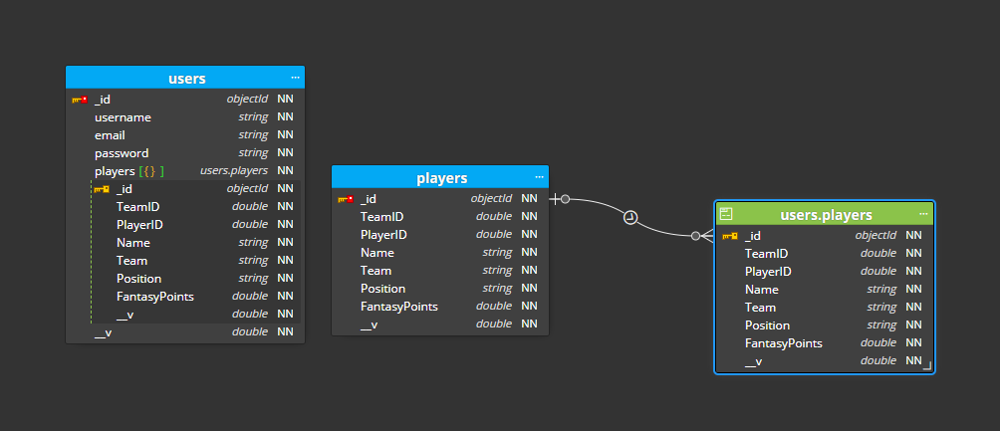

# WhoYaGot
 
 

## Table of Contents
* [WhoYaGot](#WhoYaGot)
* [Description](#Description)
* [Installation instructions](#Installation-instructions)
* [Usage Information](#Usage-Information)
* [Contribution Guidelines](#Contribution-Guidelines)
* [Test Instructions](#Test-Instructions)
* [License](#License)
* [Questions](#Questions)
## Description
* Who Ya Got is a Fantasy Hockey web application. A user can create an account and then pick 6 NHL players for their fantasy team. Once their team is made they are able to compare fantasy teams with other users.
### WhoYaGot, Reverse Engineering Database
 
## Installation instructions
NPM package requires for this project are :
* MERN stack
* React
* Apollo Server
* GraphQL 
* CSS
* Ant Design
* Material UI
* React.js
* MongoDB Atlas
## Usage Information
* This Who Ya Got  is for personal and professional use.
## Contribution Guidelines 
* This is a final product that is ready to be used.
* [WhoYaGot-Login  Git Hub](https://github.com/MiguelJerome/WhoYaGot-Heroku-Deploy)
* [WhoYaGot-Login Heroku](https://cryptic-stream-92735.herokuapp.com/)
## Test Instructions
* This Who Ya Got  works is also ready to be used.
### WhoYaGot, 10 Sample Of User Full Team Build Database
### go in the server side folder and enter from the (CLI) in the terminal: npm run seed
 
### You can use the tenTeamUserSample.json file to test your login on our Web site, and you're able to do the Query Appolo graphql
## License
* MIT License

Copyright (c) [2022] [Miguel Jerome] [William Whelan-Cox] [Marty Nolan] [Austin Heweston]

Permission is hereby granted, free of charge, to any person obtaining a copy
of this software and associated documentation files (the "Software"), to deal
in the Software without restriction, including without limitation the rights
to use, copy, modify, merge, publish, distribute, sublicense, and/or sell
copies of the Software, and to permit persons to whom the Software is
furnished to do so, subject to the following conditions:

The above copyright notice and this permission notice shall be included in all
copies or substantial portions of the Software.

THE SOFTWARE IS PROVIDED "AS IS", WITHOUT WARRANTY OF ANY KIND, EXPRESS OR
IMPLIED, INCLUDING BUT NOT LIMITED TO THE WARRANTIES OF MERCHANTABILITY,
FITNESS FOR A PARTICULAR PURPOSE AND NONINFRINGEMENT. IN NO EVENT SHALL THE
AUTHORS OR COPYRIGHT HOLDERS BE LIABLE FOR ANY CLAIM, DAMAGES OR OTHER
LIABILITY, WHETHER IN AN ACTION OF CONTRACT, TORT OR OTHERWISE, ARISING FROM,
OUT OF OR IN CONNECTION WITH THE SOFTWARE OR THE USE OR OTHER DEALINGS IN THE
SOFTWARE.
## Questions
* [MiguelJerome](https://github.com/MiguelJerome/) Github
* [WilliamWhelan-Cox](https://github.com/willycoxy) Github
* [MartyNolah](https://github.com/MCN17) Github
* [AustinHeweston](https://github.com/AHewetson) Github
* How to reach us: You use contact us on GitHub